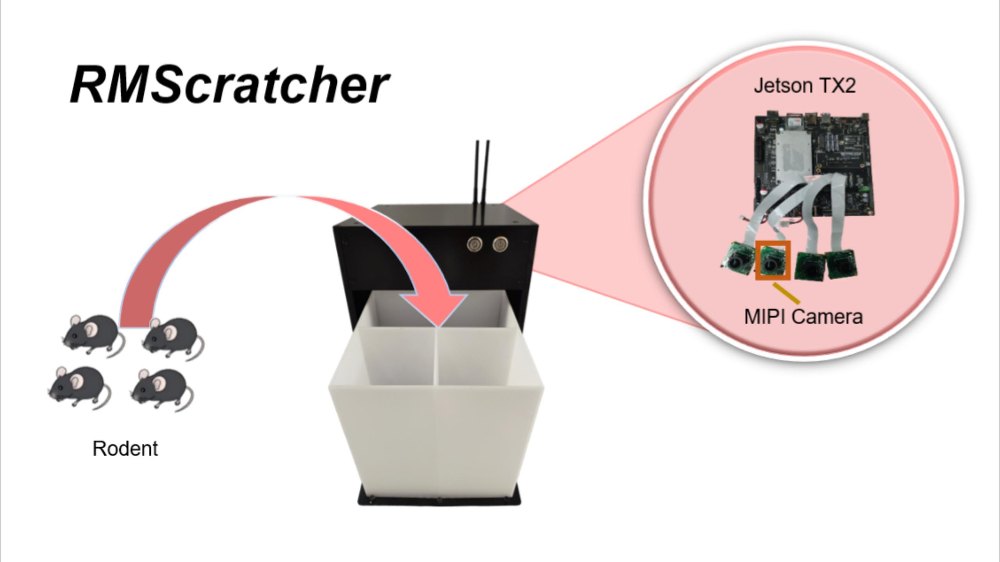
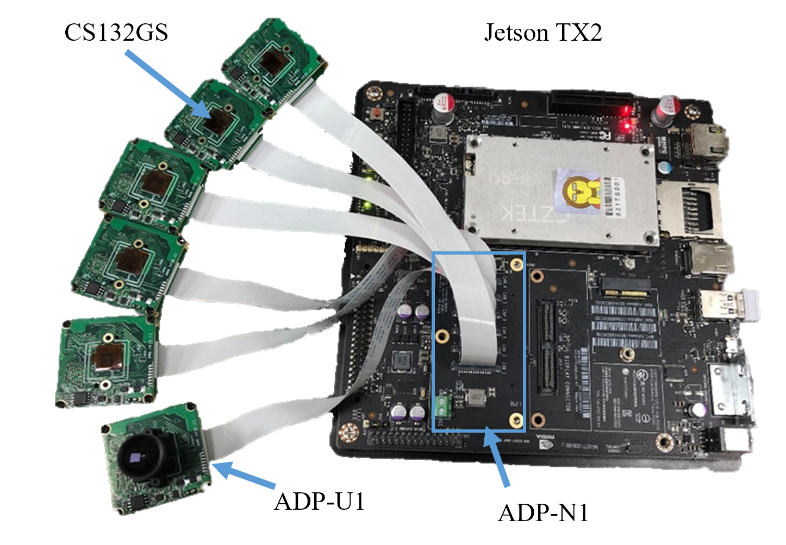
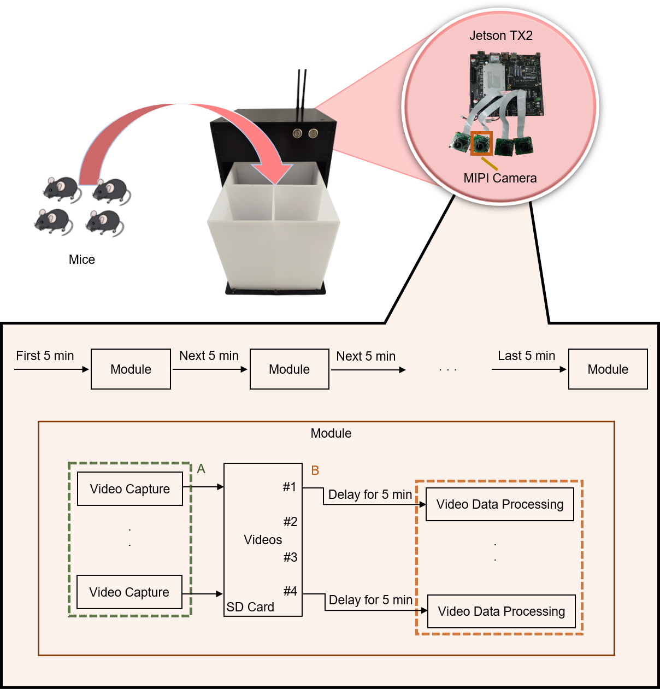
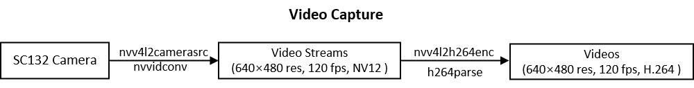
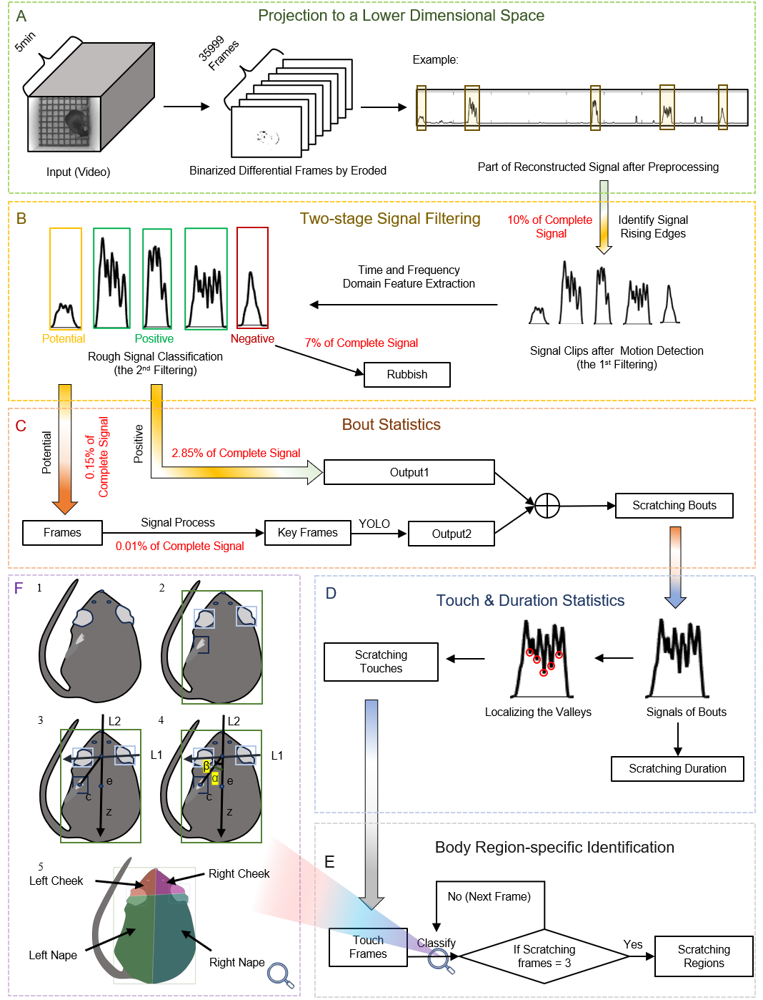

# RMScratcher 👋

Welcome to my GitHub profile! We are passionate developers for building innovative software and hardware solutions. Here you will find a collection of RMScratcher.

RMScratcher is A Real-time Multi-Channel Compact Rodent Scratching Behavior Recognition System based on Edge Computing.

## 🎥 Demo
* Use this system:

* If you use an HDMI cable to connect to the mini display, you can see the following:

This is just a demo. In actual use, due to the performance limitations of TX2, it is not yet available. However, we are exploring other higher-performance edge computing platforms and are expected to add this feature.
## 🚀 Setup Requirements

### Hardware Requirements 
* **MIPI Camera module:** CS-TX2-XAVIER-nCAM 

* **Platform:** Nvidia Jetson Tx2 [[Website]](https://www.nvidia.com/en-us/autonomous-machines/embedded-systems/jetson-tx2/)

* **Other Materials:** Metal plates, LED light panels, etc.

### Software Requirements

* **Languages:** Python
* **Libraries:** Install the required libraries using pip:
  `pip install -r requirements.txt`

## 🛠️ Construction Process

### 1. Hardware construction process
If you need more hardware information, please refer to (click the hyperlink) [[Details]](Hardware\Hardware_info.md)

### 2. Software construction process
If you need more Software information, please refer to (click the hyperlink) [[Details]](Software\Software_info.md)

The workflow is:

This is the flowchart of the recording process:

This is the flowchart of video data processing:

## 🌟 Open Source Licenses
The software and hardware is licensed under the Apache License 2.0, with the following restrictions:
1. Use of this software is restricted to non-commercial purposes, including academic research and educational use.
2. The author retains all rights to seek patents on any innovations derived. Even if a patent is applied for, non-commercial use by others is not restricted.
3. For any commercial use or redistribution, explicit permission from the author is required.
