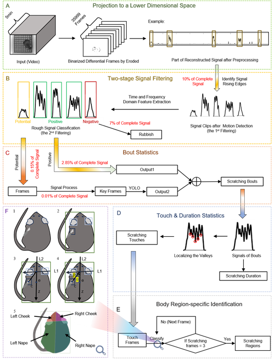

# Software Solutions

## GStreamer Preview and Recording  
The Jetson platform supports GStreamer. On the Jetson TX2 platform, GStreamer leverages hardware encoding and decoding to improve performance and efficiency. Using GStreamer, Jetson TX2 can easily handle video capture, processing, transmission, and display.  

GStreamer is a framework for building streaming media applications, designed to process audio, video, and other media stream data. Its plugin-based architecture enables most functionalities to be implemented as shared libraries, known as elements, which serve as the building blocks for media pipelines. In GStreamer, each decoder, encoder, demultiplexer, or video/audio output is an element. Elements are connected via pads, which are responsible for data transfer and format negotiation.  

In the GStreamer framework:  
- **Elements** perform tasks such as capture, encoding, decoding, filtering, and mixing. Based on the input and output pads they support, elements can be categorized into sink elements, source elements, and filter-like elements.  
- **GstBin** combines multiple elements into a logical unit, allowing for easier control and management.  
- **Pad** serves as an element's interface for external interaction. Data flows from one element's src-pad to another's sink-pad. The pad's 
- **Capabilities** specify the data formats the element can handle.  
- **Pipeline** is a series of connected elements that define the processing flow of multimedia streams.  

The GStreamer pipeline in this system has two main functions:  
1. Previewing four video streams on-screen simultaneously.  
2. Configuring recording parameters and performing scheduled recordings.  

NVIDIA's GStreamer build can utilize the Jetson platform's built-in video codec, NVIDIA NVCODEC, enabling video transcoding with low CPU usage (approximately 20% of a single core).  

### Elements Used in This Section  
1. **nvv4l2camerasrc**: Captures video streams from V4L2-compatible camera devices.  
2. **nvvidconv**: Converts video formats with hardware acceleration and interpolation methods.  
3. **nvv4l2h264enc**: Encodes video into H.264 format with hardware acceleration and configurable parameters.  
4. **splitmuxsink**: Splits video streams into multiple files and starts a new file when size limits are reached.  
5. **h264parse**: Parses H.264 bitstreams and provides related metadata.  
6. **nvcompositor**: Merges multiple video streams into one output stream, supporting hardware-accelerated scaling, cropping, and rotation.  
7. **nvoverlaysink**: Renders video streams to the screen with hardware acceleration and window configuration.  

### Preview Workflow  
In the preview process, GStreamer implements a complex multi-view video compositor:
1. Four **nvv4l2camerasrc** devices provide input video streams.  
2. **nvvidconv** converts these streams into RGBA format using NVIDIA Memory Manager (NVMM).  
3. **nvcompositor** merges the four streams into a multi-view video frame. Each stream is arranged in a preset rectangle position and size (640 × 480 pixels), occupying the top-left, bottom-left, top-right, and bottom-right corners of the composite frame.  
4. The merged video stream is displayed on the screen using **nvoverlaysink**.  

### Recording Workflow  
In the recording process, as shown in Figure 2-5(b):  
1. **nvv4l2camerasrc** captures video from specified devices.  
2. The video is processed as follows:  
   - Converted to UYVY format, resized to 640 × 480, and set to 120 FPS in NVMM memory.  
   - **nvvidconv** converts it to NV12 format and compresses it to 320 × 240 to reduce data size for subsequent signal extraction.  
   - **nvv4l2h264enc** encodes it into H.264 format.  
3. These elements collaborate to achieve efficient video processing and encoding.  

This workflow highlights the high performance and flexibility of GStreamer for multimedia handling on the Jetson platform.

## Software Workflow

### Reading Saved Videos  
Videos are saved every 5 minutes. The algorithm monitors the SD card folder in real time to check for the presence of saved video files. Once detected, the videos are loaded into memory for processing.  

### Processing Video Data  
This section is described in great detail in the article. Please refer to the article for more information.

